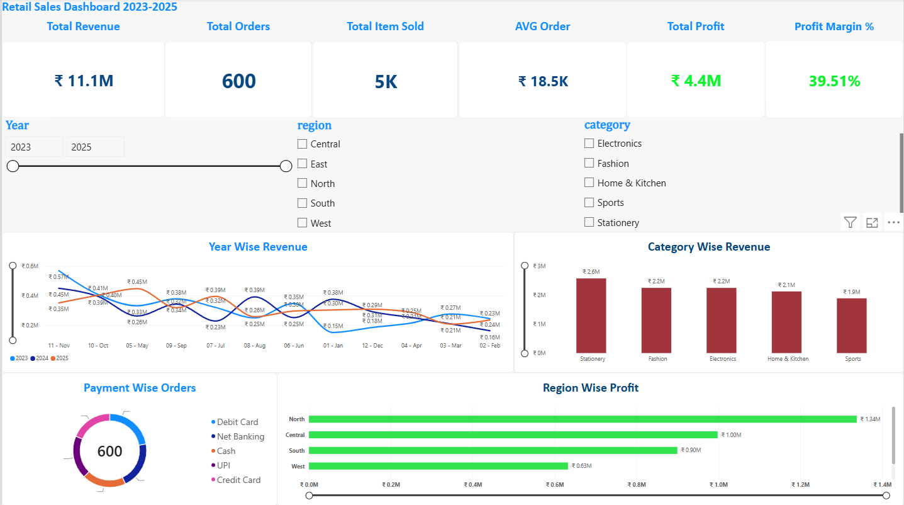
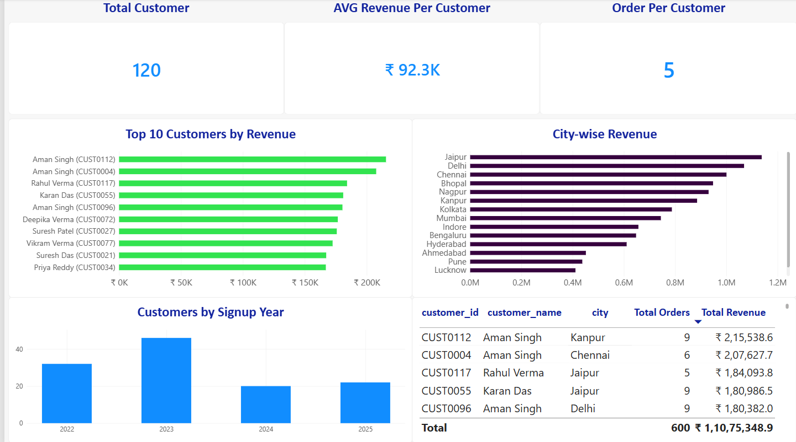
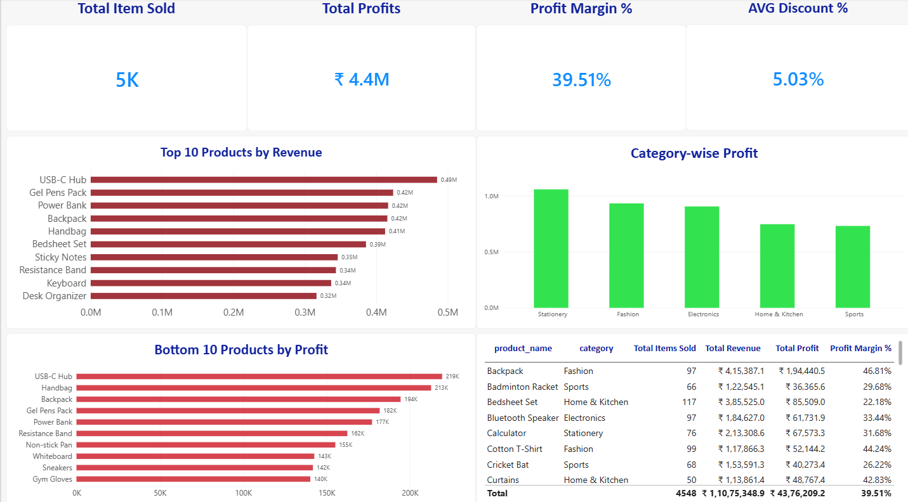
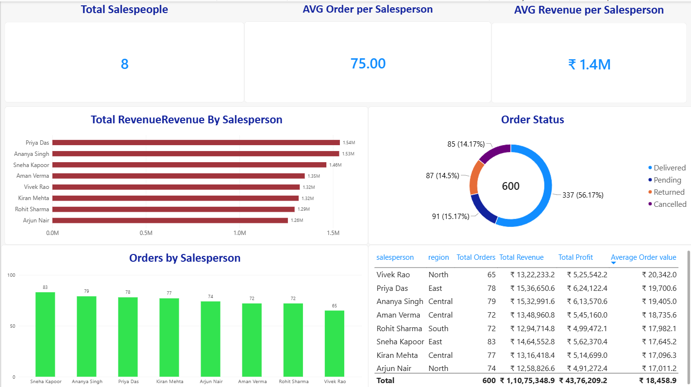
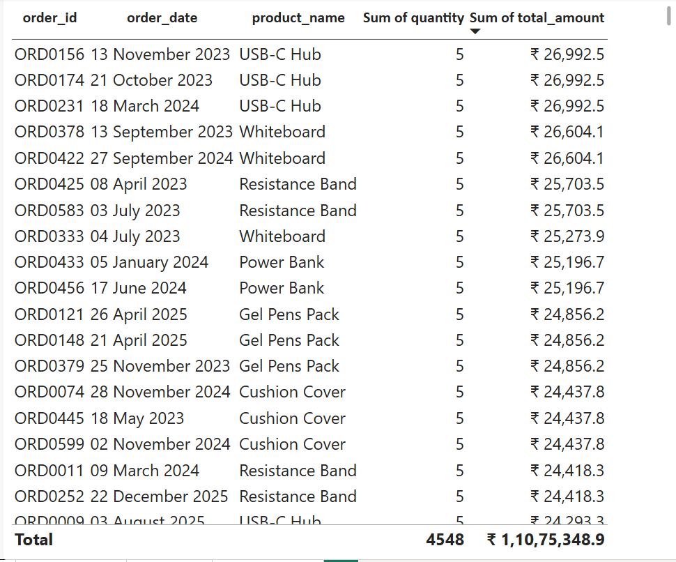
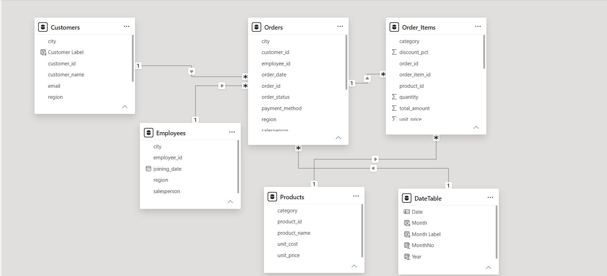

# Retail Sales Analysis Dashboard (Power BI)

An end-to-end Power BI project on a 5-table retail dataset (2023-2025): data cleaning in Power Query, star-schema modeling, DAX measures, and a 4-page interactive dashboard with drill-through.

## Business Questions
- How are revenue, orders and profit performing overall, and how do they trend year over year?
- Which regions, categories and products drive revenue and profit?
- Who are the top customers and which cities bring the most revenue?
- How do salespeople compare, and what is the order status split (delivered / cancelled / returned)?

## Dashboard Preview
| Overview | Customer Insights |
| --- | --- |
|  |  |

| Product Insights | Sales Team |
| --- | --- |
|  |  |

**Customer Detail (drill-through)**



**Data Model (Star Schema)**



## Key Numbers
| Metric | Value |
|---|---|
| Total Revenue | Rs 11.08M |
| Total Profit | Rs 4.38M (39.5% margin) |
| Total Orders | 600 |
| Total Customers | 120 |
| Average Order Value | Rs 18.46K |
| Average Discount | 5.03% |

## Key Insights
- **North** is the most profitable region (Rs 1.33M), followed by Central and South.
- **Stationery** leads in revenue (Rs 2.6M) and profit; all 5 categories are within a close range.
- **USB-C Hub** is the top product by revenue.
- **Priya Das** and **Ananya Singh** are the top salespeople (about Rs 1.5M each).
- Only **56% of orders are delivered**; cancelled, returned and pending orders together make up about 44%, a clear area to improve.
- Customer sign-ups peaked in **2023** (46 customers).
- Payment methods are evenly spread (each about 19-22%), so no single method dominates.

## Data
5 CSV files in `/data`:

| Table | Type | Rows |
|---|---|---|
| Orders | Fact | 600 (after cleaning) |
| Order_Items | Fact | ~1,500 |
| Customers | Dimension | 120 |
| Products | Dimension | 50 |
| Employees | Dimension | 8 |

Plus a `DateTable` created with DAX.

## What I Did

**1. Data Cleaning (Power Query)**
- Trimmed spaces and fixed casing (`city`, `customer_name`, `payment_method`)
- Fixed mixed date formats and set correct data types
- Removed 4 duplicate orders (by `order_id`)
- Handled nulls (blank region replaced with "Unknown") and removed invalid rows (null quantity, negative price)

**2. Data Modeling**
- Star schema with 5 one-to-many relationships
- Fact tables: Orders, Order_Items. Dimensions: Customers, Products, Employees, DateTable

**3. DAX Measures**
```dax
Total Revenue = SUM(Order_Items[total_amount])
Total Orders = DISTINCTCOUNT(Order_Items[order_id])
Average Order Value = DIVIDE([Total Revenue], [Total Orders])
Total Cost = SUMX(Order_Items, Order_Items[quantity] * RELATED(Products[unit_cost]))
Total Profit = [Total Revenue] - [Total Cost]
Profit Margin % = DIVIDE([Total Profit], [Total Revenue])
YTD Revenue = TOTALYTD([Total Revenue], DateTable[Date])
Last Year Revenue = CALCULATE([Total Revenue], SAMEPERIODLASTYEAR(DateTable[Date]))
YoY Growth % = DIVIDE([Total Revenue] - [Last Year Revenue], [Last Year Revenue])
```

**4. Dashboard (4 pages)**
- **Overview:** KPI cards, year-wise revenue, category revenue, payment split, region profit
- **Customer Insights:** top 10 customers, city-wise revenue, sign-ups by year
- **Product Insights:** top 10 products, bottom 10 by profit, category profit
- **Sales Team:** salesperson leaderboard, order status, orders by salesperson
- Slicers (Year, Region, Category) synced across pages, page navigator, drill-through to Customer Detail

## Files
```
retail-sales-powerbi-dashboard/
  data/            5 CSV files
  dashboard/       Retail_Sales_Dashboard.pbix
  screenshots/     dashboard page images
  README.md
```

## How to Open
1. Download `Retail_Sales_Dashboard.pbix` from `/dashboard`
2. Open in Power BI Desktop (free)
3. If data source path errors appear: Transform data, then Data source settings, then point to the `/data` folder

## Tools
Power BI Desktop, Power Query, DAX, Star Schema Modeling

## Author
**[MOHD]** | CS Student | Aspiring Data Analyst
